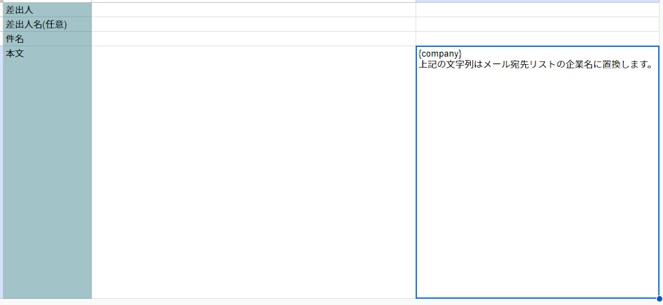

# 問合せメール

## 問合せ先取得

### 1. Google Custom Searchの使用を開始
Google Custom Searchを利用します。  
以下で作成したAPIキー/検索エンジンIDをconfigシートの各項目に設定してください。
- APIキー  
[Google Developer Console](https://console.developers.google.com/?hl=JA)から任意のプロジェクトを作成し、認証情報 -> 認証情報を作成より `APIキー` を作成し取得。
- 検索エンジンID  
[Custom Search Engine](https://programmablesearchengine.google.com/controlpanel/all)より検索エンジンを作成し、概要欄から `検索エンジンID` を取得。

### 2. 問合せ先取得
企業リストの `企業名列` に検索する企業名を1～100件記入してください。  
`URL列` に任意の文字列が存在する場合、 **検索対象外** となります。  
  
スプレッドシート右上 `メニュー` -> `問合せ先取得` を選択すると検索を開始。  
企業リストシートにURLが追加され、
メール宛先リストシートに企業名と取得できたメールアドレスを追記します。

## メール送信

### 1. メールテンプレートを作成

設定にしたがってメールを作成します。  
以下の項目の入力は必須です。
1. 差出人
2. 件名
3. 本文  
本文については、置換文字列 `{company}` が使用できます。  
使用することでメール宛先リストにある**企業名**に置換されます。

### 2. メール送信
メールテンプレートの必須項目が入力され、かつメール宛先リストに有効なデータが1～30件ある場合メール送信します。  
`企業名列` または `メールアドレス列` が空欄の場合、メールは送信しません。  
スプレッドシート右上 `メニュー` -> `メール送信` を選択するとメールを送信。
